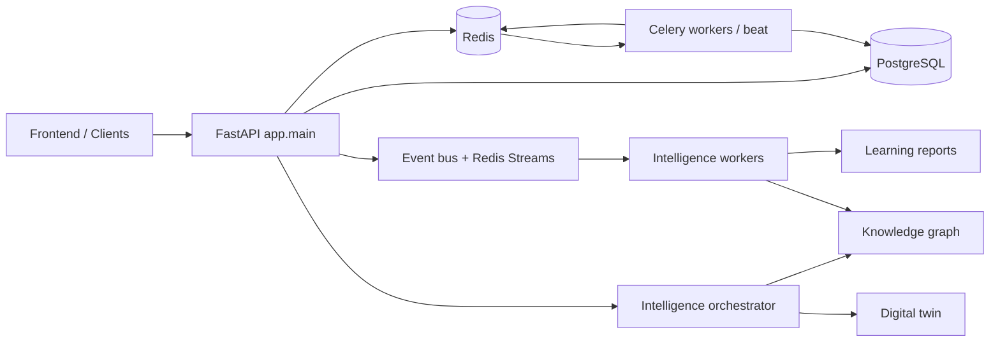

# Platform Documentation

This directory describes the runtime platform implemented by the backend in this repository. It is intentionally code-linked: every document references concrete modules under `backend/app`, `backend/scripts`, `backend/alembic`, and the deployment assets in the repository root.

## Document map

- `platform_overview.md`: top-level platform summary and execution model
- `system_architecture.md`: process model, core services, and runtime boundaries
- `intelligence_engine.md`: intelligence pipeline, orchestration, digital twin, and learning loop
- `knowledge_graph.md`: local/global knowledge graph and graph update mechanics
- `event_system.md`: synchronous event bus, Redis Streams, and outbox flow
- `worker_architecture.md`: Celery queues, intelligence workers, queue controls, and worker partitioning
- `api_architecture.md`: FastAPI boot path, router layout, and control-plane boundaries
- `observability.md`: metrics, tracing, health, telemetry, and operational inspection
- `scalability_model.md`: horizontal scaling assumptions, bottlenecks, and capacity model

## Runbooks

- `runbooks/deployment_runbook.md`
- `runbooks/incident_response.md`
- `runbooks/worker_recovery.md`
- `runbooks/database_maintenance.md`
- `runbooks/load_testing.md`

## Primary code references

- API bootstrap: `backend/app/main.py`
- Settings and environment model: `backend/app/core/settings.py`
- Database and Redis clients: `backend/app/db/session.py`, `backend/app/db/redis_client.py`
- API router composition: `backend/app/api/v1/router.py`
- Celery runtime: `backend/app/tasks/celery_app.py`, `backend/app/tasks/intelligence_tasks.py`
- Event spine: `backend/app/events/event_bus.py`, `backend/app/events/event_stream.py`, `backend/app/events/subscriber_registry.py`
- Outbox: `backend/app/events/emitter.py`, `backend/app/events/outbox/event_outbox.py`, `backend/app/intelligence/workers/outbox_worker.py`
- Intelligence orchestrator: `backend/app/intelligence/intelligence_orchestrator.py`
- Knowledge graph: `backend/app/intelligence/knowledge_graph/update_engine.py`, `backend/app/models/knowledge_graph.py`
- Global graph and industry learning: `backend/app/intelligence/global_graph/graph_service.py`, `backend/app/intelligence/industry_models/industry_learning_pipeline.py`
- Deployment assets: `docker-compose.yml`, `backend/Dockerfile`

## Runtime summary

The backend is a multi-plane platform:

1. FastAPI serves tenant APIs, control-plane APIs, health endpoints, metrics, and startup invariants.
2. PostgreSQL stores transactional data, intelligence artifacts, and the event outbox.
3. Redis backs Celery, Redis Streams, liveness heartbeats, and selected runtime coordination.
4. Celery workers handle product queues and scheduled jobs.
5. The intelligence subsystem uses both direct orchestration (`run_campaign_cycle`) and an event-driven chain for feature, pattern, recommendation, simulation, execution, and learning updates.

