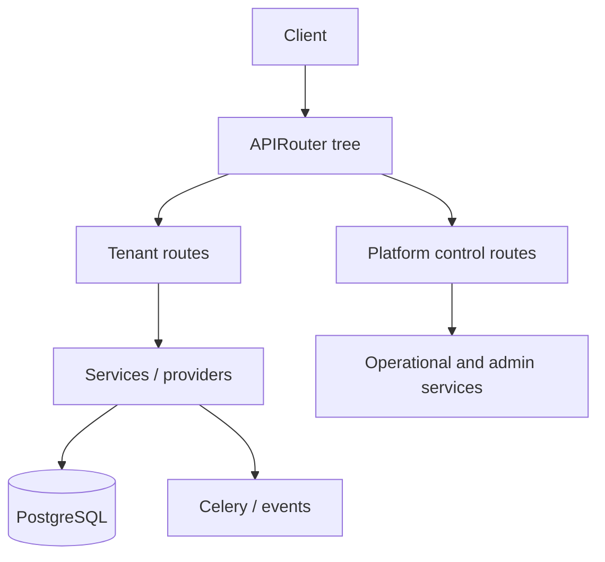

# API Architecture

## Boot path

The HTTP surface is defined in `backend/app/main.py`.

Key runtime elements:

- FastAPI app construction with lifespan startup
- middleware stack for correlation ID, logging, throttling, request size, rate limiting, metrics, security headers, and CORS
- optional Prometheus `/metrics`
- internal metrics endpoint at `/internal/metrics`
- structured exception envelopes through `backend/app/api/response.py`

## Router composition

The root API router composition is in `backend/app/api/v1/router.py`.

### Tenant API routers

Representative routers include:

- `health`
- `auth`
- `campaigns`
- `crawl`
- `rank`
- `content`
- `entity`
- `provider_credentials`
- `provider_health`
- `provider_metrics`
- `intelligence`
- `intelligence_metrics`
- `intelligence_simulations`
- `recommendations`
- `executions`
- `reports`
- `strategy_memory`
- `business_locations`
- `locations`

### Control-plane routers

- `platform_control`
- `system_operational`

## Boundary model

## Authentication and authorization

The routers use dependency-injected auth/role enforcement from:

- `backend/app/api/deps.py`
- `require_platform_role`
- `require_platform_owner`

Platform-only endpoints are separated rather than mixed into tenant routers.

## Operational APIs

Two especially important platform APIs are:

- `backend/app/api/v1/platform_control.py`
- `backend/app/api/v1/system_operational.py`

They expose:

- organization platform management
- provider health summaries
- audit inspection
- operational health
- data freshness summaries

## Runtime characteristics

- The API process is designed to be mostly stateless.
- Redis-backed rate limiting is optional and controlled through settings.
- Metrics and tracing are environment-driven and can be disabled without changing code paths.
- In production-like deployments, Redis is a startup dependency, not an optional enhancement.
