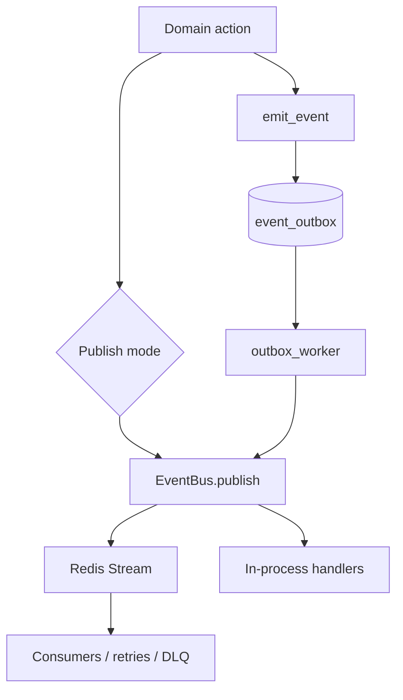

# Event System

## Overview

The platform has two eventing mechanisms and one durable event staging mechanism:

1. in-process publish/subscribe through `backend/app/events/event_bus.py`
2. Redis Streams transport in `backend/app/events/event_stream.py`
3. a PostgreSQL outbox in `backend/app/events/emitter.py` and `backend/app/events/outbox/event_outbox.py`

This is not redundant by accident. Each path solves a different reliability or latency problem.

## Direct event bus

`EventBus.publish` does two things:

- writes the event to the stream through `publish_to_stream`
- invokes subscribed handlers in-process

That means a single publish can have both immediate side effects and a persisted stream record.

## Redis Streams

The Redis Streams implementation uses:

- stream key: `lsos:intelligence:events`
- consumer group: `lsos-intelligence`
- DLQ stream: `lsos:intelligence:events:dlq`

The stream layer tracks:

- processed IDs per consumer
- event state hashes
- checkpoints
- retry counts

If retries exceed `MAX_RETRIES`, the event is dead-lettered.

## Outbox

The outbox is a separate durability boundary. `emit_event`:

- builds an `EventEnvelope`
- writes an `AuditLog`
- inserts a row into `event_outbox`
- deduplicates by `event_type` and `payload_hash`

`backend/app/intelligence/workers/outbox_worker.py` then:

- loads pending rows
- validates the JSON into `EventEnvelope`
- publishes the event on the event bus
- marks rows `processed` or `failed`

## Event system diagram

## Default subscriber chain

`backend/app/events/subscriber_registry.py` defines the default chain:

- `SIGNAL_UPDATED -> signal_processor`
- `FEATURE_UPDATED -> pattern_processor`
- `PATTERN_DISCOVERED -> recommendation_processor`
- `RECOMMENDATION_GENERATED -> simulation_processor`
- `SIMULATION_COMPLETED -> execution_processor`
- `EXECUTION_COMPLETED -> outcome_processor`
- `OUTCOME_RECORDED -> enqueue_learning_event`
- `EXPERIMENT_COMPLETED -> enqueue_experiment_event`

## Failure model

Important current behaviors:

- handler failures are logged and do not stop publication to other handlers
- Redis Stream failures can be retried and dead-lettered
- outbox rows can remain pending or fail independently of direct publish
- test mode replaces Redis Streams with an in-memory implementation

## Operational caveats

- Because direct handler execution happens in the publishing process, a handler bug can still affect request latency.
- Because the outbox worker republishes onto the same event bus, duplicate handling protection relies on event-level idempotence and outbox deduplication.
- Stream state lives in Redis, so Redis loss impacts replayability unless the originating domain action was also captured through the outbox.
