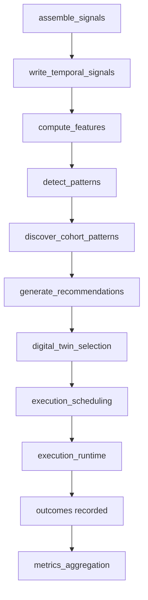

# Intelligence Engine

## Primary pipeline

The canonical campaign intelligence pipeline is implemented in `backend/app/intelligence/intelligence_orchestrator.py` as `run_campaign_cycle`.

The current stage order is explicit in `PIPELINE_STAGES`:

1. `assemble_signals`
2. `write_temporal_signals`
3. `compute_features`
4. `detect_patterns`
5. `discover_cohort_patterns`
6. `generate_recommendations`
7. `digital_twin_selection`
8. `execution_scheduling`
9. `execution_runtime`
10. `policy_learning`
11. `metrics_aggregation`

## Pipeline flow

## Stage implementation references

- signal assembly: `backend/app/intelligence/signal_assembler.py`
- temporal persistence: `backend/app/intelligence/temporal_ingestion.py`
- feature generation: `backend/app/intelligence/feature_store.py`
- pattern engines: `backend/app/intelligence/pattern_engine.py`, `backend/app/intelligence/cohort_pattern_engine.py`
- policy and recommendation generation: `backend/app/intelligence/policy_engine.py`
- digital twin selection: `backend/app/intelligence/digital_twin/strategy_optimizer.py`
- execution scheduling and runtime: `backend/app/intelligence/recommendation_execution_engine.py`
- metrics aggregation: `backend/app/intelligence/intelligence_metrics_aggregator.py`

## Legacy and modern pipeline coexistence

`run_campaign_cycle` still bridges legacy diagnostics into the modern intelligence spine:

- `collect_legacy_diagnostics`
- `diagnostics_to_patterns`
- `diagnostics_to_policy_inputs`
- `build_legacy_packaging`

Those adapters live under `backend/app/intelligence/legacy_adapters`. This means the current platform is not purely graph-native yet; it is a reconciled runtime that uses both legacy diagnostic outputs and newer graph/simulation components.

## Digital twin

The digital twin chooses among candidate strategies after recommendation generation.

Core files:

- state model: `backend/app/intelligence/digital_twin/twin_state_model.py`
- strategy optimizer: `backend/app/intelligence/digital_twin/strategy_optimizer.py`
- simulation engine: `backend/app/intelligence/digital_twin/strategy_simulation_engine.py`
- trainable models: `backend/app/intelligence/digital_twin/models`

Selection behavior today:

- iterate candidate strategies
- simulate each strategy
- select the highest `expected_value`
- persist selection on the chosen `DigitalTwinSimulation` row when a DB session is present

Training currently runs in `backend/app/intelligence/digital_twin/models/training_pipeline.py`, which derives coefficients from:

- `RecommendationOutcome`
- `CampaignDailyMetric`
- `StrategyCohortPattern`
- `TemporalSignalSnapshot`

This is a lightweight training loop rather than an external ML platform.

## Event-driven intelligence chain

In parallel to orchestrator-driven execution, the repository contains an event-driven intelligence chain registered by `backend/app/events/subscriber_registry.py`:

```mermaid
flowchart LR
    SU[SIGNAL_UPDATED] --> FU[feature_processor]
    FU --> FE[FEATURE_UPDATED]
    FE --> PA[pattern_processor]
    PA --> PD[PATTERN_DISCOVERED]
    PD --> RE[recommendation_processor]
    RE --> RG[RECOMMENDATION_GENERATED]
    RG --> SI[simulation_processor]
    SI --> SC[SIMULATION_COMPLETED]
    SC --> EX[execution_processor]
    EX --> EC[EXECUTION_COMPLETED]
    EC --> OU[outcome_processor]
```

Notable detail: learning and experiment completion are dispatched onto workers rather than executed inline:

- `OUTCOME_RECORDED -> enqueue_learning_event`
- `EXPERIMENT_COMPLETED -> enqueue_experiment_event`

## Learning loop

The current learning loop is split across causal, evolution, and telemetry paths:

- causal worker: `backend/app/intelligence/workers/causal_worker.py`
- evolution worker: `backend/app/intelligence/workers/evolution_worker.py`
- learning metrics snapshots/reports: `backend/app/intelligence/telemetry`

The experiment worker composes the causal and evolution workers in `backend/app/intelligence/workers/experiment_worker.py`.

Current behavior from code:

- causal learning updates graph edges and mechanism models
- evolution generates new policies/experiments and emits telemetry
- reports are persisted through `persist_learning_report`
- the standalone learning worker is presently a no-op compatibility placeholder in `backend/app/intelligence/workers/learning_worker.py`

That last point matters operationally: not every learning event currently causes material model updates.

## Runtime concurrency

`run_system_cycle` can parallelize campaign cycles using `CampaignWorkerPool` when it owns its DB session. This is the primary built-in horizontal concurrency mechanism for batch intelligence runs.
