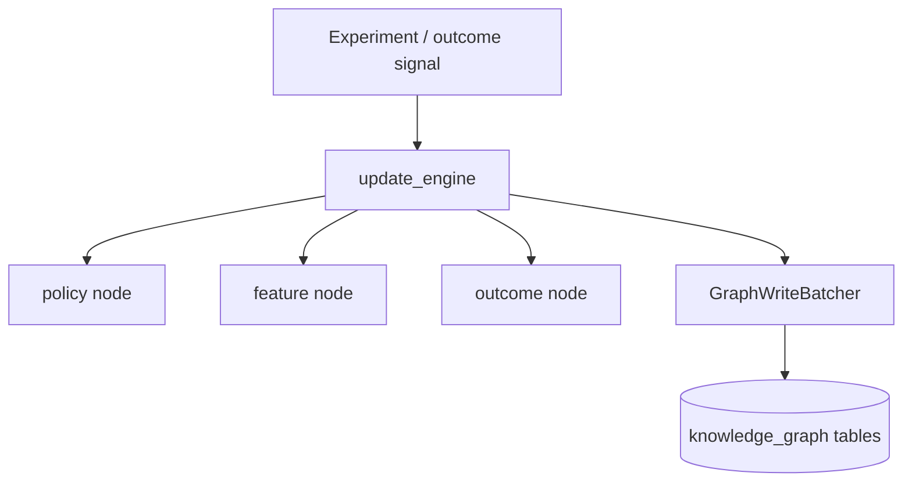

# Knowledge Graph

## Graph layers

The repository contains more than one graph-oriented subsystem.

### Transactional knowledge graph

This is the graph persisted through:

- model definitions in `backend/app/models/knowledge_graph.py`
- write/update logic in `backend/app/intelligence/knowledge_graph/update_engine.py`
- query helpers in `backend/app/intelligence/knowledge_graph/query_engine.py`

It stores durable graph entities such as:

- `KnowledgeNode`
- `KnowledgeEdge`

### Global graph runtime

A second graph runtime exists under `backend/app/intelligence/global_graph`, exposed via:

- `get_graph_store`
- `get_graph_query_engine`
- `get_graph_update_pipeline`

This layer is used by event processors such as `pattern_processor` and `simulation_processor`.

### Industry learning graph

Industry-level learning is updated through `backend/app/intelligence/industry_models/industry_learning_pipeline.py`.

## Current write model

The core durable write path is in `update_global_knowledge_graph` inside `backend/app/intelligence/knowledge_graph/update_engine.py`.

For a given policy/feature/outcome observation it ensures nodes for:

- industry
- policy
- feature
- outcome

Then it writes or updates three edge types:

- `policy_feature`
- `feature_outcome`
- `policy_outcome`

Policy evolution is recorded separately through `record_policy_evolution` as a `policy_policy` edge.

## Batch flush behavior

The write engine uses `GraphWriteBatcher` with two runtime controls from `backend/app/core/settings.py`:

- `knowledge_graph_batch_size`
- `knowledge_graph_flush_interval_ms`

This means graph writes are batched in-process and only flushed when:

- the batch size threshold is reached, or
- the flush interval expires, or
- a forced flush is requested

That behavior is important for throughput and for understanding why a graph update may not be visible immediately after a single enqueue.

## Graph update diagram

## Event integration

The graph is updated from multiple places:

- causal learning worker path
- pattern processor via `get_graph_update_pipeline().update_from_pattern`
- simulation processor via `get_graph_update_pipeline().update_from_simulation`
- industry learning pipeline updates from pattern, simulation, and outcome payloads

## Observed runtime semantics

Based on the current code and tests:

- graph writes are additive and weighted by sample size
- existing edges are updated using weighted averages for `effect_size` and `confidence`
- tests such as `backend/tests/test_global_knowledge_graph.py`, `backend/tests/test_knowledge_graph_contract.py`, and `backend/tests/integration/test_platform_event_chain.py` validate graph persistence and event-driven updates

## Operational implications

- Graph consistency depends on DB commit boundaries in the worker or request path.
- The transactional knowledge graph is durable; the global graph service may also maintain its own runtime state path, so operators should treat it as a separate subsystem until unified.
- Because some graph writes are batched, incident responders should force or wait for flushes before declaring data loss.
