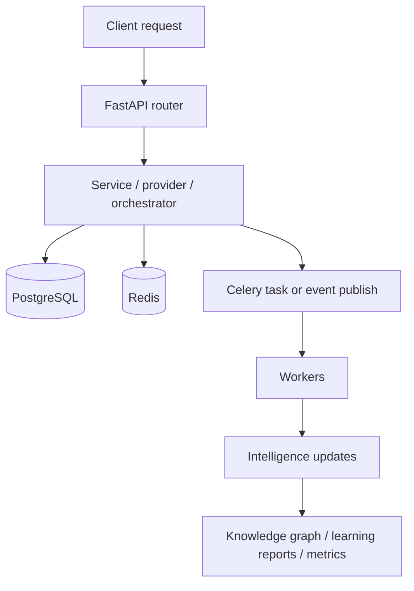

# Platform Overview

## What this platform is

This repository implements a multi-tenant SEO operations platform with three tightly coupled runtime layers:

- an HTTP control and data plane built on FastAPI in `backend/app/main.py`
- a transactional and analytical persistence layer centered on PostgreSQL models in `backend/app/models`
- an automation and intelligence layer spanning Celery tasks, Redis-backed eventing, digital twin simulation, and graph-based learning under `backend/app/intelligence`

The platform is not a simple request/response app. Several user actions initiate downstream asynchronous work that may touch:

- provider execution modules in `backend/app/providers`
- service-layer orchestration in `backend/app/services`
- Celery queues and scheduled tasks in `backend/app/tasks`
- the event chain in `backend/app/events` and `backend/app/intelligence/event_processors`
- graph and learning updates in `backend/app/intelligence/knowledge_graph`, `global_graph`, `causal`, `evolution`, and `telemetry`

## Runtime planes

### 1. API plane

The API plane is created in `backend/app/main.py`. Startup does the following:

- validates invariants with `run_startup_invariants`
- initializes Redis Streams with `initialize_event_stream`
- registers event subscribers with `register_default_subscribers`
- initializes model defaults with `initialize_default_models`
- verifies Redis connectivity in non-test environments
- seeds a local admin user when the user table exists

Middleware provides request logging, throttling, request-size limits, optional Redis-backed rate limiting, metrics, security headers, CORS, and correlation IDs.

### 2. Work execution plane

The work execution plane is split:

- product/background workloads run through Celery in `backend/app/tasks/celery_app.py`
- lightweight intelligence worker dispatch uses `backend/app/events/queue.py`
- campaign intelligence orchestration can run directly or via `CampaignWorkerPool` in `backend/app/intelligence/campaign_workers/campaign_worker_pool.py`

### 3. Intelligence plane

The intelligence plane is driven by:

- `run_campaign_cycle` and `run_system_cycle` in `backend/app/intelligence/intelligence_orchestrator.py`
- the event processor chain in `backend/app/intelligence/event_processors`
- the digital twin in `backend/app/intelligence/digital_twin`
- graph updates in `backend/app/intelligence/knowledge_graph/update_engine.py`
- evolution and learning workers in `backend/app/intelligence/workers`

## Core infrastructure dependencies

The current local deployment model is explicit in `docker-compose.yml`:

- `postgres` for transactional state
- `redis` for broker, result backend, Redis Streams, and heartbeats
- `api` for FastAPI
- `worker` for Celery workers
- `beat` for Celery Beat schedules
- `mailhog` for SMTP capture in local/staging-like environments

The image is built from `backend/Dockerfile`.

## End-to-end execution shape

## Key design choices reflected in code

- The API process fails fast when Redis is unavailable outside tests: `backend/app/main.py`, `backend/app/db/redis_client.py`.
- Test mode is intentionally different: it uses in-memory Celery and no Redis client in `backend/app/core/settings.py`.
- Intelligence is partly synchronous and partly event-driven. `run_campaign_cycle` executes a full pipeline inline, while `register_default_subscribers` wires an event chain that can trigger background worker jobs.
- Queue admission control exists before enqueue through `LSOSTask.apply_async` and `admit_enqueue` in the Celery path.
- There is both a persistent event outbox and a direct event stream. That is deliberate and documented in `event_system.md`.
