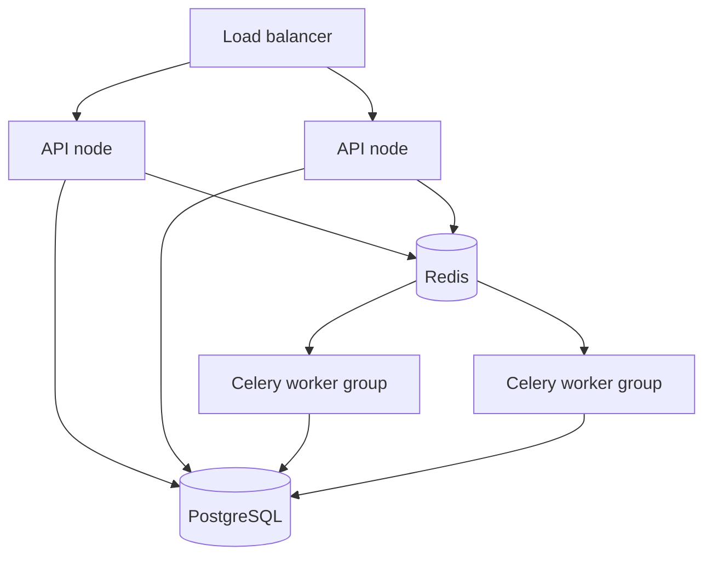

# Scalability Model

## Scaling assumptions

The current platform scales horizontally, but not uniformly. Different subsystems have different bottlenecks.

### API plane

The FastAPI process can be scaled horizontally behind a load balancer if:

- all nodes share the same PostgreSQL and Redis
- no correctness depends on in-process mutable state
- rate limiting and coordination remain Redis-backed

`main.py` already warns about selected module-level mutable structures when multi-worker deployment is detected.

### Celery plane

Celery is the main horizontal execution fabric for:

- provider-backed work
- scheduled maintenance and intelligence cycles
- asynchronous product workflows

Scaling is mostly queue-driven.

### Intelligence plane

The intelligence plane has mixed scaling characteristics:

- `run_system_cycle` can parallelize campaign processing up to 8 local workers when it owns the session
- Redis Stream and event handler execution can fan out processing
- graph writes are still serialized through DB flush/commit boundaries
- some worker dispatch controls are process-local, not globally distributed

## Bottlenecks

### PostgreSQL

Primary bottleneck for:

- recommendation persistence
- execution/result writes
- graph node/edge updates
- learning reports and telemetry snapshots
- outbox processing

### Redis

Primary bottleneck for:

- Celery broker throughput
- Redis Streams event fan-out
- heartbeat and queue inspection
- any Redis-backed rate limiting

### Process-local controls

`backend/app/events/queue.py` maintains queue depth and inflight counters in memory. That means those specific backpressure limits are local to a process, not cluster-global.

## Scaling diagram

## Practical scaling strategy

1. Separate API and worker autoscaling.
2. Scale Celery by queue class rather than a single shared pool.
3. Watch DB write amplification from knowledge-graph and execution-heavy workloads.
4. Keep Redis latency low; both queueing and eventing depend on it.
5. Treat the outbox and experiment pipeline as write-heavy paths when estimating capacity.

## Capacity-sensitive code paths

- `backend/app/intelligence/intelligence_orchestrator.py`
- `backend/app/intelligence/knowledge_graph/update_engine.py`
- `backend/app/events/event_stream.py`
- `backend/app/tasks/celery_app.py`
- `backend/app/services/operational_telemetry_service.py`
- `backend/scripts/staging_load_simulation.py`

## Known limits in current implementation

- queue admission and worker inflight counters are not globally coordinated
- campaign execution locking is per-process
- event handlers can still run inline in the publisher path
- graph batching improves throughput but does not remove DB contention
- test-mode behavior understates Redis/Celery operational complexity

## What to measure before scaling

- API p95/p99 latency
- Redis broker latency
- queue depth by queue
- Celery task duration by queue
- DB slow-query rate
- graph write batch size and flush frequency
- experiment backlog and outbox backlog
