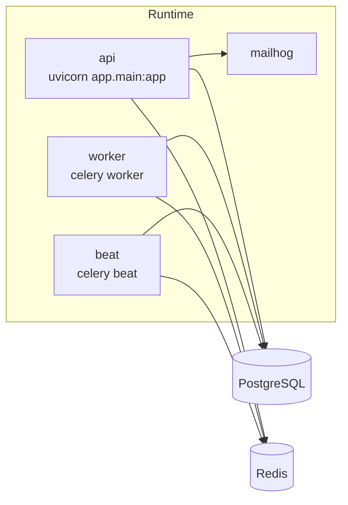

# System Architecture

## Process model

The platform currently runs as a small service cluster defined in `docker-compose.yml`.

## Boot sequence

### API boot

`backend/app/main.py` creates the FastAPI application and performs these runtime-critical steps in lifespan startup:

- startup invariants: `app.governance.startup_invariants.run_startup_invariants`
- Redis Stream initialization: `app.events.initialize_event_stream`
- default event subscriptions: `app.events.subscriber_registry.register_default_subscribers`
- model bootstrap: `app.intelligence.model_registry.initialize_default_models`
- Redis availability check: `app.db.redis_client.get_redis_client`

### Worker boot

`backend/app/tasks/celery_app.py` creates the Celery app. In non-test environments it:

- runs startup invariants
- validates Redis connectivity
- publishes worker and scheduler heartbeats to Redis keys defined in `backend/app/infra/contracts.py`

## Data architecture

### Primary system of record

PostgreSQL is the durable source of truth for:

- tenants, users, memberships, roles
- campaigns, crawl/rank/content/local/provider artifacts
- intelligence recommendations, executions, outcomes, experiments
- knowledge graph nodes and edges
- learning metric snapshots and reports
- outbox events and audit logs

The engine/session layer is implemented in `backend/app/db/session.py`. It adds query timing instrumentation with SQLAlchemy event hooks and forwards slow-query telemetry to `record_query_duration`.

### Volatile coordination layer

Redis is used for:

- Celery broker and result backend
- Redis Streams event transport in `backend/app/events/event_stream.py`
- worker and scheduler heartbeats
- rate limiting middleware
- queue-depth inspection and health probes

## Architectural domains

### Request domain

FastAPI routers live in `backend/app/api/v1`. `backend/app/api/v1/router.py` composes:

- tenant-facing routers such as `campaigns`, `crawl`, `rank`, `reports`, `intelligence`
- control-plane routers such as `platform_control` and `system_operational`

### Service domain

Business logic is concentrated under `backend/app/services`. These services bridge HTTP, provider calls, persistence, and automation telemetry.

### Event domain

The event domain is composed of:

- direct in-process publish/subscribe in `backend/app/events/event_bus.py`
- Redis Stream persistence and replay support in `backend/app/events/event_stream.py`
- default pipeline subscriptions in `backend/app/events/subscriber_registry.py`
- persistent outbox storage in `backend/app/events/emitter.py` and `backend/app/events/outbox/event_outbox.py`

### Intelligence domain

The intelligence domain spans:

- orchestrator: `backend/app/intelligence/intelligence_orchestrator.py`
- event processors: `backend/app/intelligence/event_processors`
- digital twin: `backend/app/intelligence/digital_twin`
- graph systems: `knowledge_graph`, `global_graph`, `industry_models`
- workers: `backend/app/intelligence/workers`

## Runtime boundaries

The platform has a few important boundaries that operators need to preserve:

- API nodes should remain effectively stateless apart from process-local caches and locks. `main.py` explicitly audits a short list of files for module-level mutable state when multiple web workers are configured.
- SQLAlchemy sessions are not shared across threads. `run_system_cycle` falls back to single-session processing when a session is injected.
- Redis is a hard dependency outside tests; startup intentionally fails when it is unavailable.
- The intelligence chain mixes synchronous publish and asynchronous queue dispatch. This reduces latency for some steps, but it means failures can surface either inside a request path or later in a worker path.
