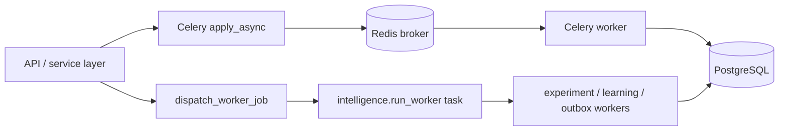

# Worker Architecture

## Worker classes

The repository contains three worker styles.

### Celery workers

Defined by `backend/app/tasks/celery_app.py` and started through `docker-compose.yml`.

Queues:

- `crawl_queue`
- `rank_queue`
- `content_queue`
- `authority_queue`
- `default_queue`

Routing is based on task-name prefix:

- `crawl.*`
- `rank.*`
- `content.*`
- `authority.*`
- everything else to `default_queue`

### Intelligence queue dispatcher

`backend/app/events/queue.py` is a second dispatch layer used for named intelligence workers:

- `learning`
- `experiment`
- `outbox`

In tests it runs inline. Outside tests it wraps Celery through `run_intelligence_worker_task`.

### Campaign worker pool

`backend/app/intelligence/campaign_workers/campaign_worker_pool.py` partitions campaigns across worker slots and can either:

- run a local threaded processor, or
- dispatch into per-partition Celery queues such as `intelligence_partition_0`

## Queue admission and backpressure

There are two explicit queue control mechanisms.

### Enqueue admission

`LSOSTask.apply_async` calls `admit_enqueue` before enqueue. Rejected tasks fail before they enter Redis.

### In-memory backpressure for intelligence workers

`dispatch_worker_job` in `backend/app/events/queue.py` enforces:

- `max_queue_depth`
- `max_worker_inflight`

It performs short retries before returning `backpressure_limit_exceeded`.

## Heartbeats and liveness

Celery worker and beat liveness are recorded in Redis:

- worker key: `infra:worker:heartbeat`
- scheduler key: `infra:scheduler:heartbeat`

These are published from signal hooks in `backend/app/tasks/celery_app.py` and read by `backend/app/services/infra_service.py`.

## Scheduled tasks

Current beat schedules include:

- daily analytics rollup
- monthly strategy automation
- nightly traffic fact sync
- system intelligence cycle every 6 hours
- daily intelligence metrics recomputation
- weekly cohort pattern discovery
- weekly digital twin training

## Worker flow diagram

## Current intelligence worker behavior

- `experiment_worker` runs causal and evolution workers sequentially in one DB session.
- `causal_worker` updates causal and mechanism learning artifacts.
- `evolution_worker` triggers strategy evolution and persists learning reports.
- `learning_worker` is presently a compatibility no-op.
- `outbox_worker` republishes pending outbox events.

## Operational guidance

- Scale Celery workers by queue specialization first, not just total process count.
- Treat `learning_worker` as low-value for incident prioritization until it performs substantive work.
- For experiment backlog, the `experiment` worker path is the critical one because it updates graph edges and learning reports.
